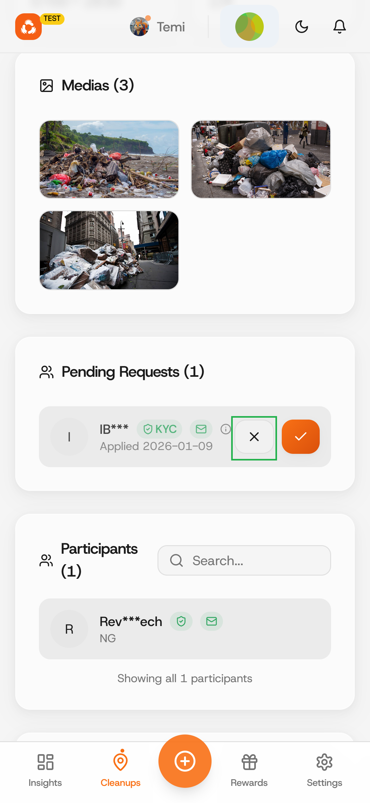

# Reject a cleanup join request

### Step 1: Review cleanup join request

<figure><figcaption></figcaption></figure> <figure><figcaption></figcaption></figure>

### Step 2: Sign Transaction

<figure><figcaption></figcaption></figure>

