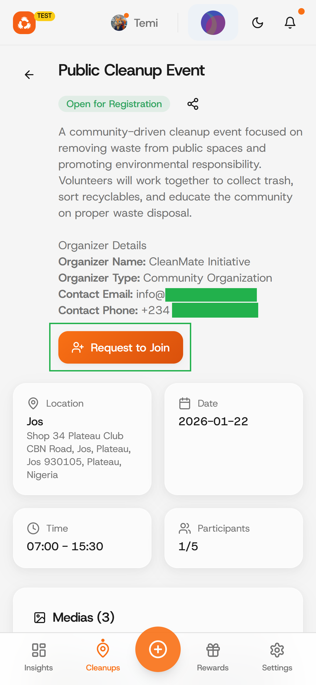
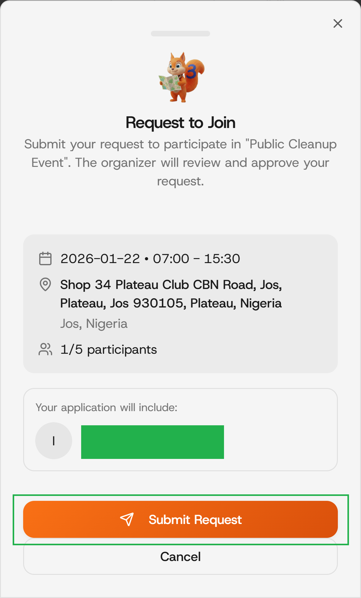

# Request to join a cleanup

### Step 1: Go to the "Cleanups" page

Click on the "Cleanups" button on the bottom of the app to navigate to its page

<figure><figcaption></figcaption></figure>

### Step 2: Find nearby and available Cleanup

Click on the "All" tab (to see all cleanups) or the "Open" tab (to see cleanups opened) among others.

<figure><figcaption></figcaption></figure>

### Step 3: Request to Join

Click on the "Request to Join" button as highlighted in the image below.

<figure><figcaption></figcaption></figure>

### Step 4: Review and confirm your interest

Review the Cleanup's details and click on the "Submit Request" to confirm your interest to join the cleanup.

<figure><figcaption></figcaption></figure>

### Step 5: Await the "Organizer(s)" approval.

Your request will be approved or rejected by the organizer(s) and the transaction would be approved.

images&#x20;
