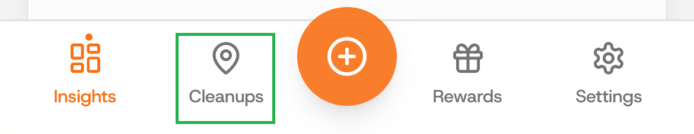
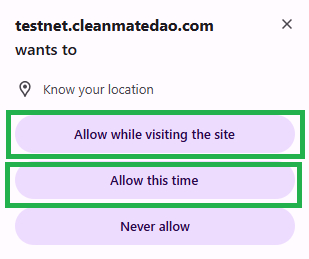

# Start a new cleanup

### Step 1: Click on the "Cleanups" button

On your Dashboard, click on the "Cleanups" button to navigate to its tab.

<figure><figcaption></figcaption></figure>

### Step 2: Allow App to know your location

When you get prompted, choose between "allow while visiting the site" and "allow this time" to allow app access your location.

<figure><figcaption></figcaption></figure>

### Step 3: See list of added Cleanups

On this page, you'll find added cleanups, you can click on the icons as annotated in the image below.

1. Settings: to select between list and map view or to set search distance.
2. Add Cleanup: to create new a cleanup.
3. You location: shows you where you currently are.
4. Cleanups nearby: shows you cleanups close to your location.
5. Status: shows you the status of the cleanups.
6. Navigation: displays buttons that would help you navigate the map.&#x20;

<figure><figcaption>
Cleanup - Map view
</figcaption></figure> <figure><figcaption>
Cleanups - List view
</figcaption></figure>

<figure><figcaption>
Cleanup Settings
</figcaption></figure>

### Step 4: KYC Verification required

Upon clicking on the "Add Cleanup" button, If you get the KYC verification alert, it means that you haven't completed KYC. KYC verification is required before you can organize or join cleanups.&#x20;


See [kyc-verification](../profile/kyc-verification/ "mention")


<figure><figcaption></figcaption></figure>

### Step 5: Fill in Cleanup details

After a successful KYC verification, you will be able to submit the details of your cleanups including title, date, time, location and others as presented in the images below.

<figure><figcaption></figcaption></figure> <figure><figcaption></figcaption></figure>

<figure><figcaption></figcaption></figure> <figure><figcaption></figcaption></figure>

After your cleanup has been created, it will be displayed on the "created" tab and upon Admin's approval it would become published and visible to other eco-champions around you.&#x20;

<figure><figcaption></figcaption></figure>


Interested in joining an already created cleanup? Read [request-to-join-a-cleanup.md](request-to-join-a-cleanup.md "mention")

