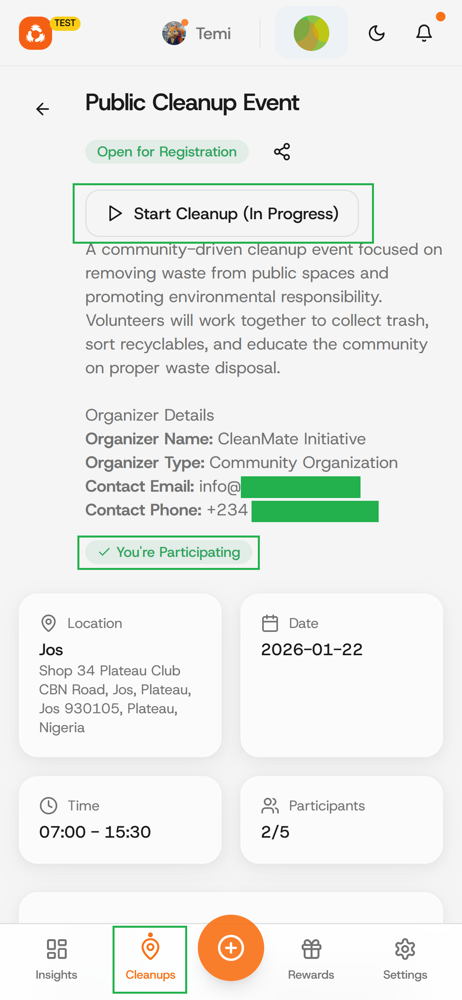
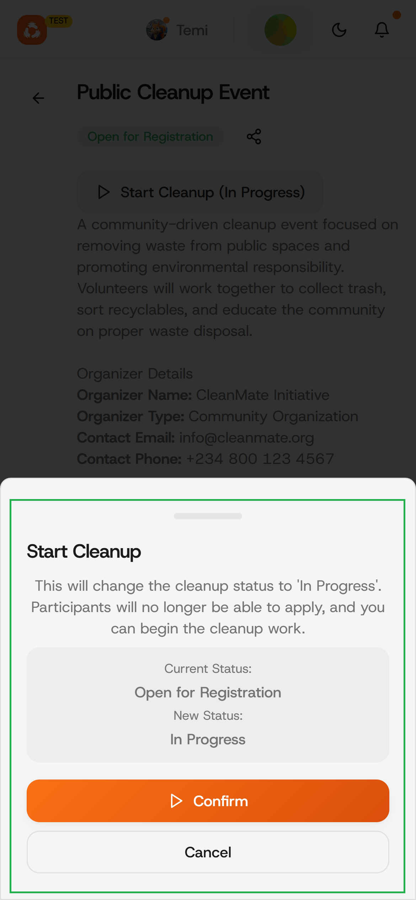
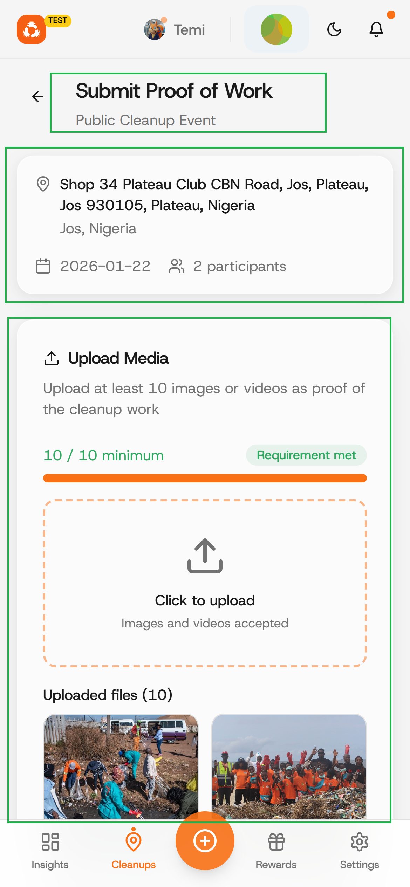
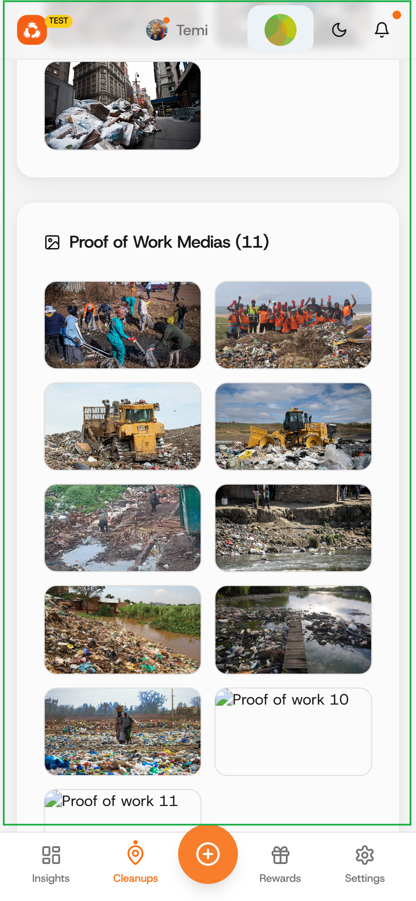
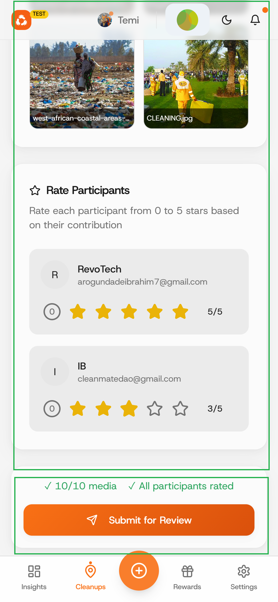
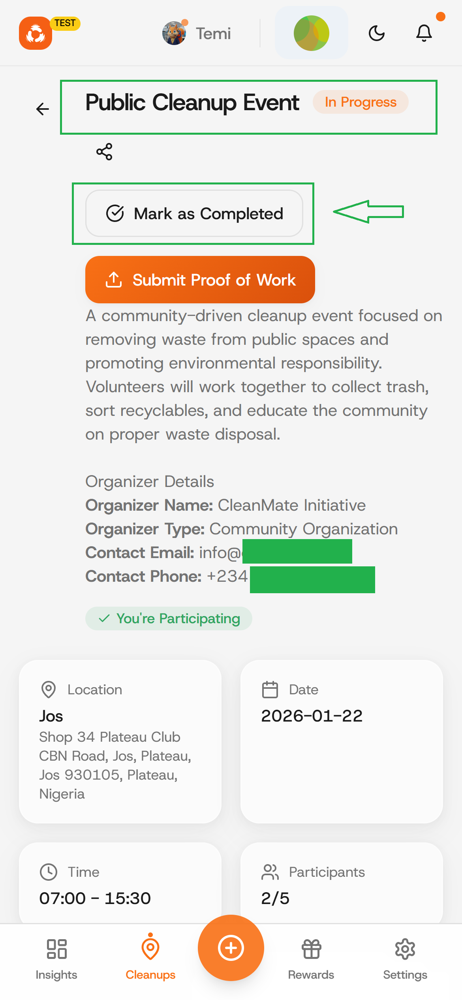
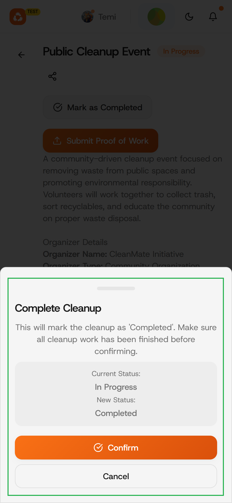
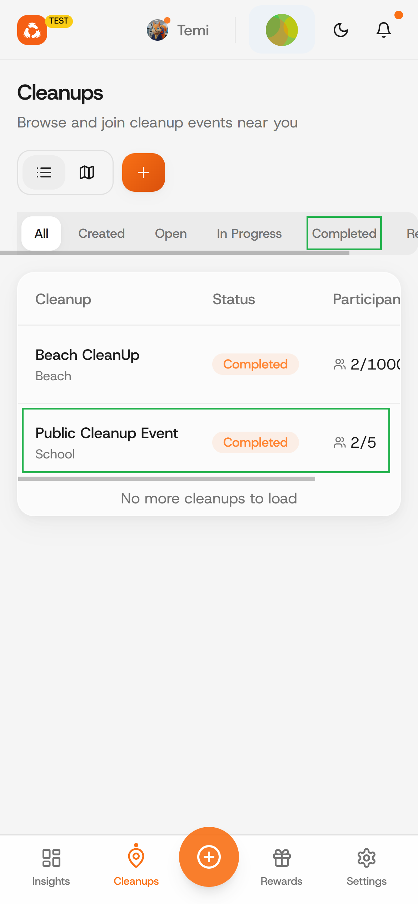

# Submit cleanup proof of work

### Step 1: Start Cleanup

Select a cleanup you want to begin (start) from the "Cleanups" tab on the bottom of the page and click on the "Start Cleanup (In Progress)" button as shown in the image below.

<figure><figcaption></figcaption></figure>

### Step 2: Confirm and Sign Transaction

Click on "confirm" to proceed and "sign and continue" to sign transaction. &#x20;

<figure><figcaption></figcaption></figure> <figure><figcaption></figcaption></figure>

### Step 3: Submit Proof of Work

Now that your cleanup is in progress, Click on the "Submit Proof of Work" button.

<figure><figcaption></figcaption></figure>

### Step 4: Add Proof of Work and Submit

Upload proof of work (images/videos captured doing your cleanup) as well as ratings for cleanup participants (by organizer).&#x20;

<figure><figcaption></figcaption></figure> <figure><figcaption></figcaption></figure> <figure><figcaption></figcaption></figure>

### Step 5: Mark as Completed

Click on the "Mark as Completed" button as highlighted in the image below.

<figure><figcaption></figcaption></figure>

### Step 6: Confirm and Sign Transaction

Click on "Confirm" and "Sign and Continue" buttons to sign transaction.&#x20;

<figure><figcaption></figcaption></figure> <figure><figcaption></figcaption></figure>

### Step 7: Cleanup Completed

You should see your Cleanup now marked as Completed (from the "Completed" or "All" tabs)

<figure><figcaption></figcaption></figure>


### Well-done, eco-warrior! An Admin will review your submission and rewards will be disbursed upon acceptance.&#x20;



### If you have any issues, see [Broken link](/broken/pages/IahUGlSUtOUHGbxPQ6Oh "mention")and re-trace your steps.

