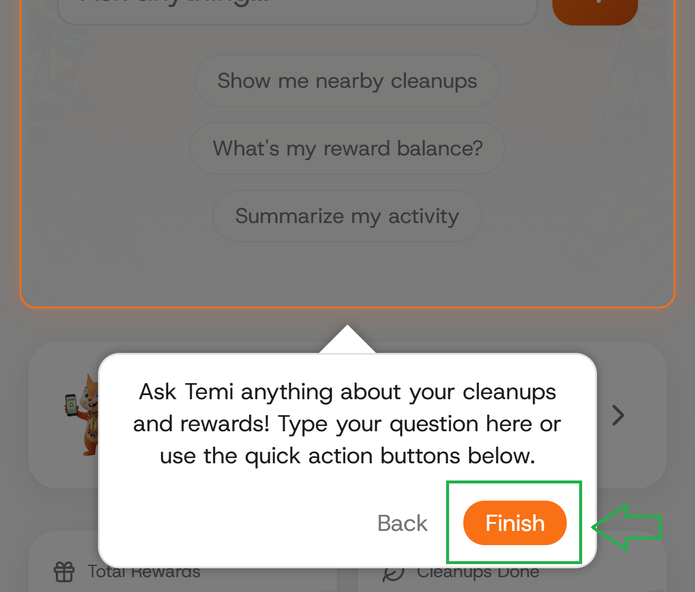
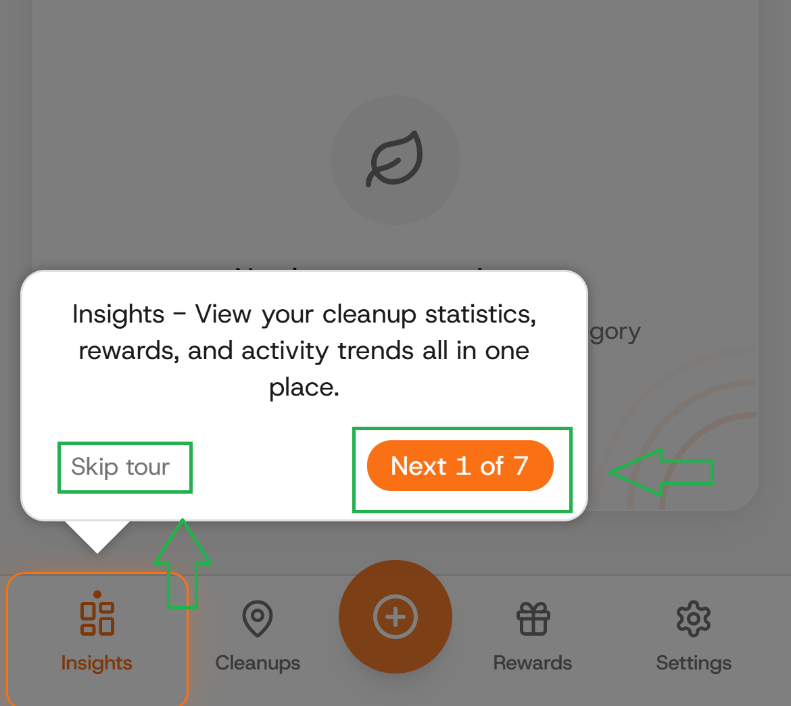
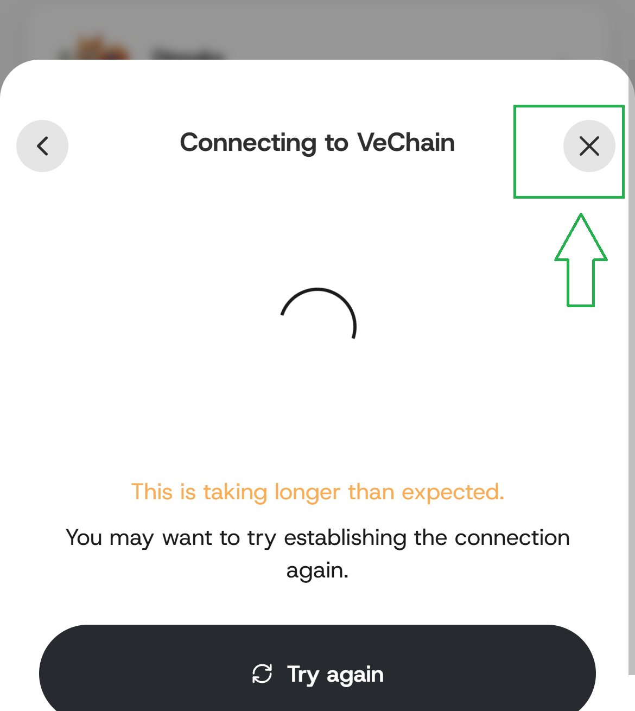
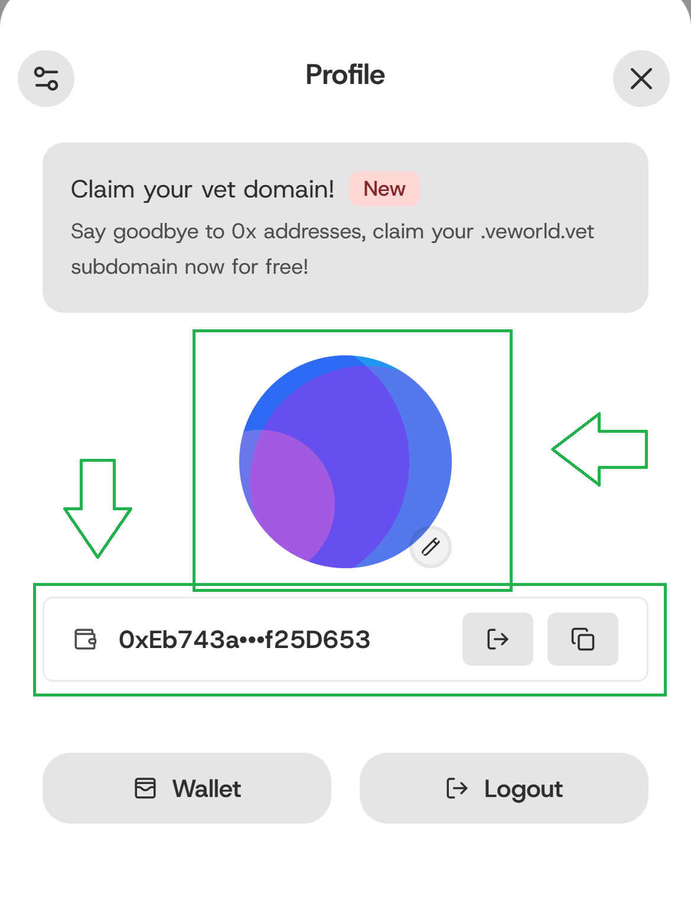

# Quickstart

### Step 1: Visit the Website.

Open your preferred browser and go to [https://cleanmatedao.com](https://cleanmatedao.com/)

<figure><figcaption></figcaption></figure>

### Step 2: Click on the "Launch App" button.

<figure><figcaption></figcaption></figure>

### Step 3: The App instructions.

Follow the app instructions or simply skip if you want to.

<figure><figcaption></figcaption></figure> <figure><figcaption></figcaption></figure>

### Step 4a: Login with your Socials (Recommended)

Click on the "Login" button. Then click on "Use social login with VeChain" button.

<figure><figcaption></figcaption></figure> <figure><figcaption></figcaption></figure>

### Step 4b: Login with your Wallet (Advanced)

> For wallet users, gas fees are not sponsored.&#x20;

Download or install VeWorld wallet [https://www.veworld.net](https://www.veworld.net/)&#x20;

<figure><figcaption></figcaption></figure>

### Step 5: View your logged account.

Click to close the loading screen if it does not closes automatically.

<figure><figcaption></figcaption></figure> <figure><figcaption></figcaption></figure> <figure><figcaption></figcaption></figure>

