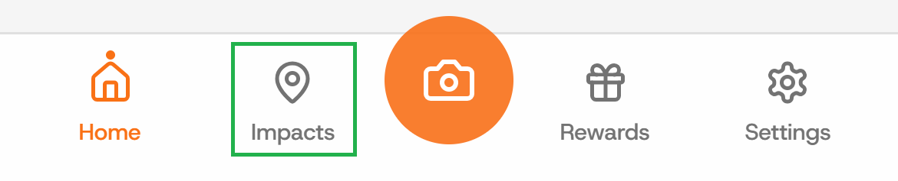
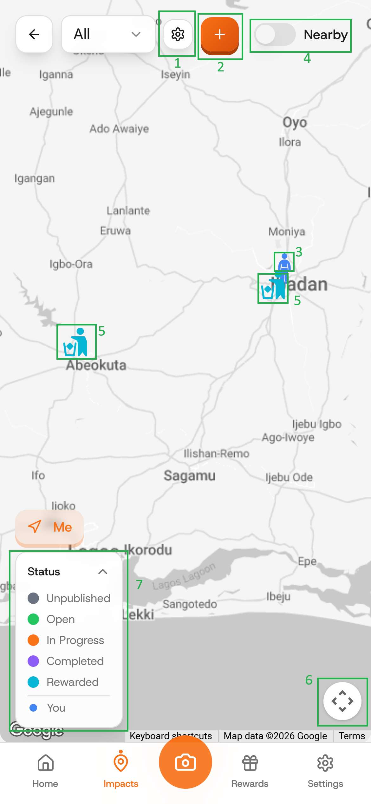
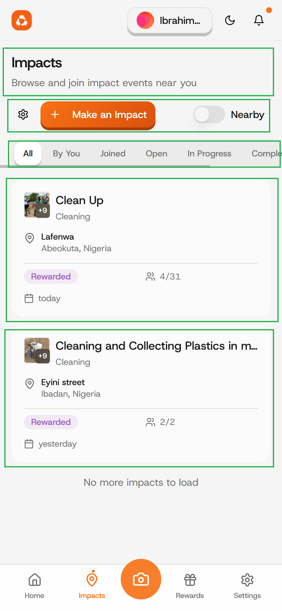

# Start a new impact

### Step 1: Click on the "Impacts" button

On your Dashboard, click on the "Impacts" button to navigate to its tab.

<figure><figcaption></figcaption></figure>

### Step 2: Allow App to know your location

When you get prompted, choose between "allow while visiting the site" and "allow this time" to allow app access your location.

<figure><figcaption></figcaption></figure>

### Step 3: See list of added Impacts

On this page, you'll find added impacts, you can click on the icons as annotated in the image below.

1. Settings: to select between list and map view or to set search distance.
2. Make an Impacts: to create new impact.
3. Your location: shows you where you currently are.
4. Nearby: shows you impacts close to your location.
5. Status: shows you the status of the impact.
6. Navigation: displays buttons that would help you navigate the map.&#x20;
7. Legend: helps you understand the visual/graphical representations on the map

<figure><figcaption>
Impact- Map view
</figcaption></figure> <figure><figcaption>
Impact- List view
</figcaption></figure>

<figure><figcaption>
Impact Settings
</figcaption></figure>

### Step 4: KYC Verification required

Upon clicking on the "Create" button, If you get the KYC verification alert, it means that you haven't completed KYC. KYC verification is required before you can create or join impact.&#x20;


See [kyc-verification](../profile/kyc-verification/ "mention")


<figure><figcaption></figcaption></figure>

### Step 5: Fill in Impact details

After a successful KYC verification, you will be able to submit the details of your impact including title, date, time, location and others as presented in the images below.

<figure><figcaption></figcaption></figure> <figure><figcaption></figcaption></figure>

<figure><figcaption></figcaption></figure> <figure><figcaption></figcaption></figure>

After your impact has been created, it will be displayed on the "created" tab and upon Admin's approval it would become published and visible to other eco-champions around you.&#x20;

<figure><figcaption></figcaption></figure>


Interested in joining an already created impact? Read [request-to-join-an-impact.md](request-to-join-an-impact.md "mention")

