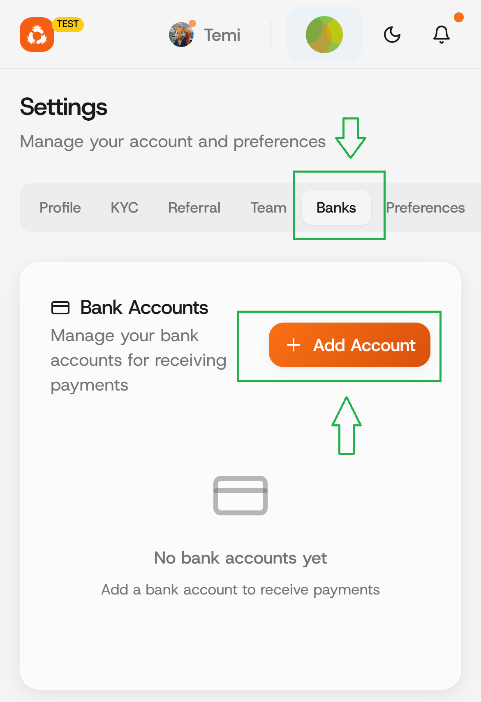
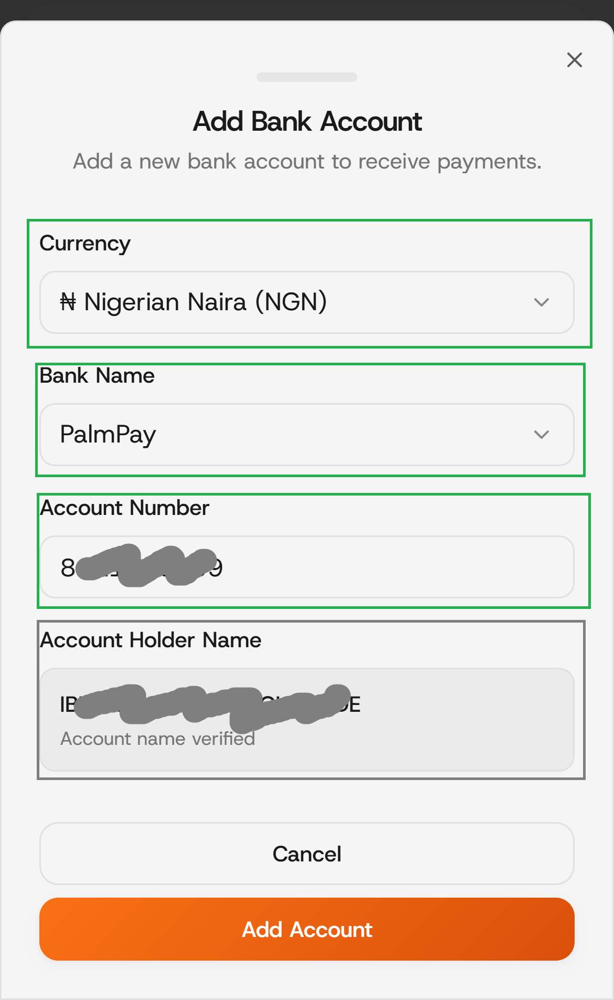
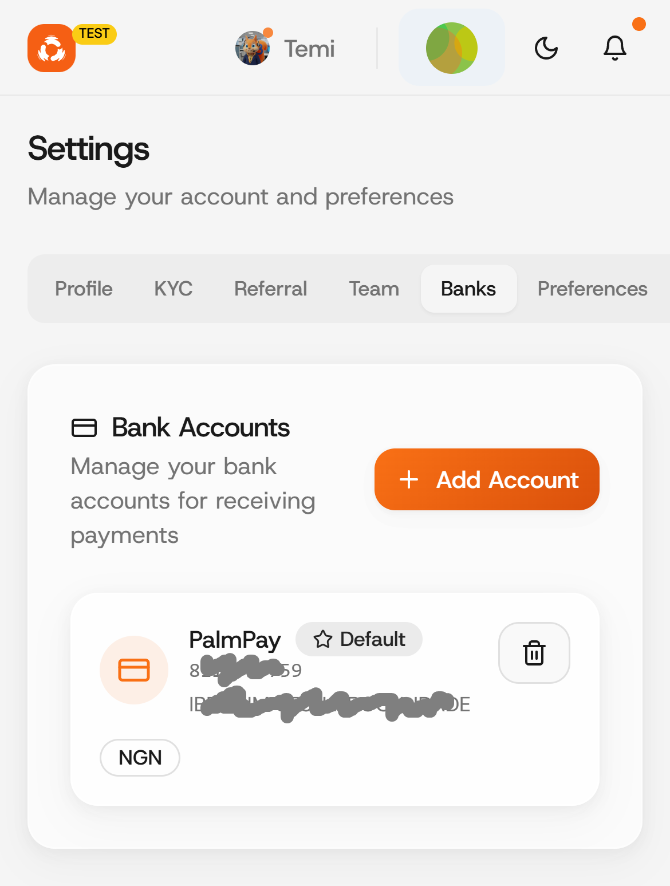

# Bank accounts

### Step 1: Click on Settings tab.

<figure><figcaption></figcaption></figure>

### Step 2: Click on the Banks tab.

Click on the Add Account button to add a new bank account.

<figure><figcaption></figcaption></figure>

### Step 3: Fill in your account details.

Enter your bank accounk details and click on the "Add Account" button.

<figure><figcaption></figcaption></figure> <figure><figcaption></figcaption></figure>

