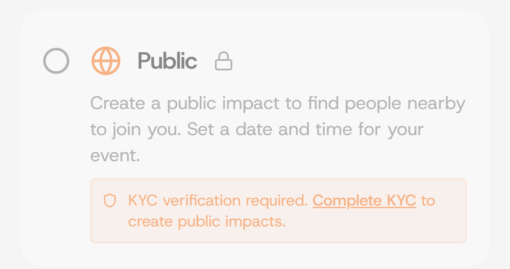

# KYC Verification

### Step 1: On the Settings tab.

<figure><figcaption></figcaption></figure>

### Step 2: Click on the "KYC" button.&#x20;

If you see "KYC not started" as displayed in the image below, kindly proceed to complete KYC verification to unlock all features.

<figure><figcaption></figcaption></figure>

### Step 3: Choose between VeBetter Passport or Native Passport.

| KYC Options       | Pros                                              | Cons                    |
| ----------------- | ------------------------------------------------- | ----------------------- |
| VeBetter Passport | Fast, and compatible with other VeBetterDAO apps. | Paid. Around $1         |
| Native Passport   | Not as fast as VeBetter Passport                  | Completely free to use. |
