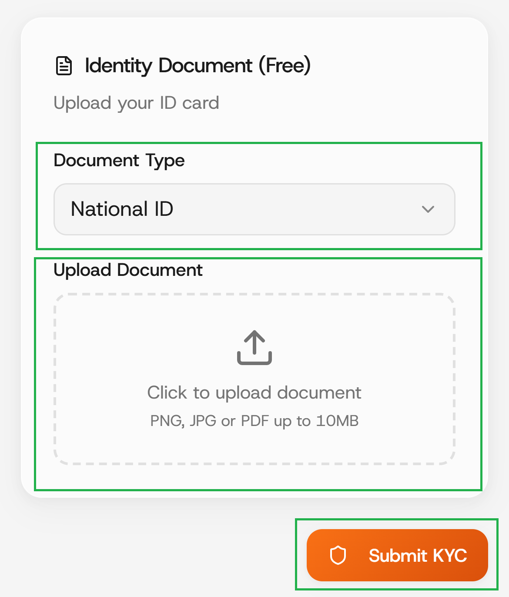

# Native Passport

### Step 1: Upload an identification document.

Select your preferred ID from the list, ensure you upload a clear and readable file in PNG, JPG or PDF format.

<figure><figcaption></figcaption></figure>

And wait for your document to be reviewed, you'll be update via email address your new KYC status within 48-72 hours.
