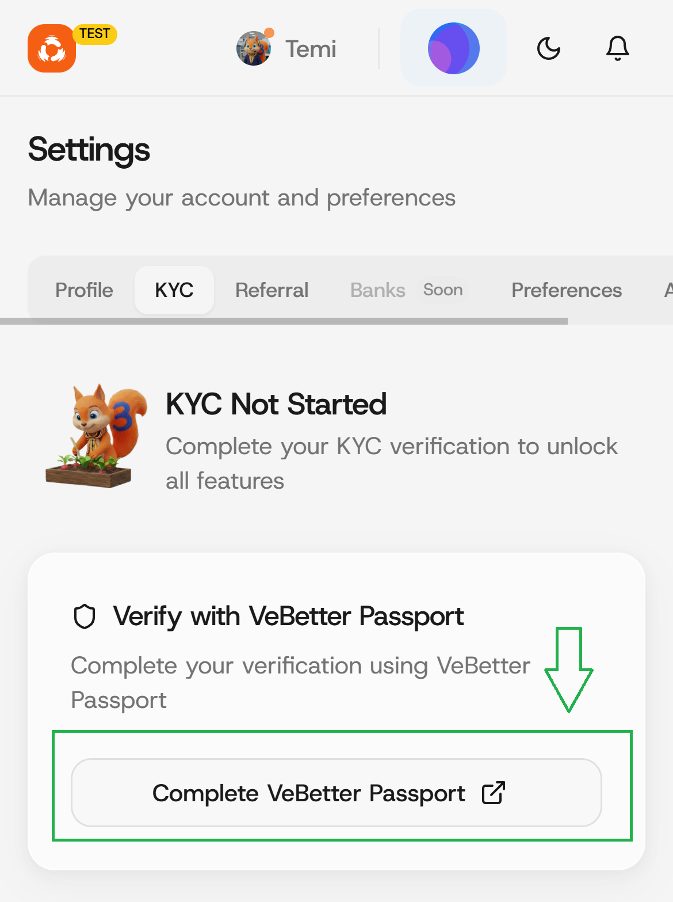

# VeBetter Passport


Note that using VeBetter requires a payment of about $1


### Step 1: Click on "Complete VeBetter Passport" button.

<figure><figcaption></figcaption></figure>

### Step 2: Connect your wallet.

Connect with the same wallet as on Cleanmate. Then click on the "Continue" button to complete your KYC with Vebetter Passport.

<figure><figcaption></figcaption></figure>

