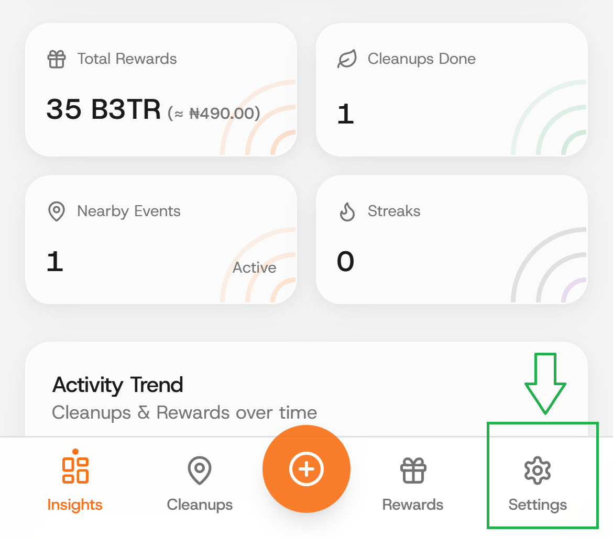

# Preferences

### Step 1: On the Settings tab.

<figure><figcaption></figcaption></figure>

### Step 2: Click on "Preferences".

You can customize appearance (dark or light theme).

And for the "plus" button action (choose between "organizing a cleanup" and "submitting a streak").

&#x20;&#x20;

<figure><figcaption></figcaption></figure>
