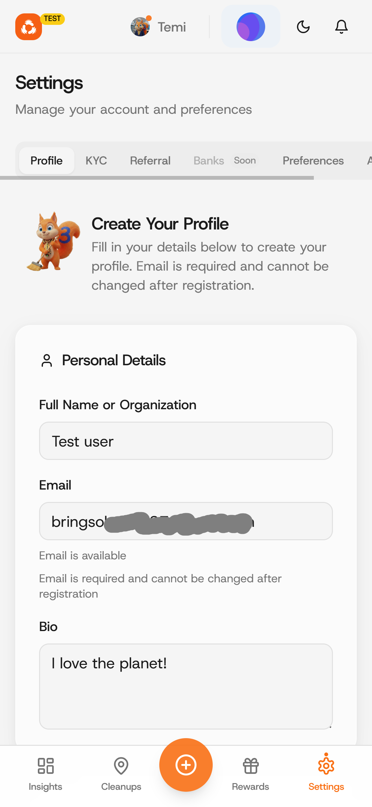
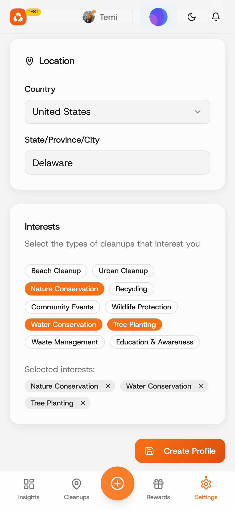
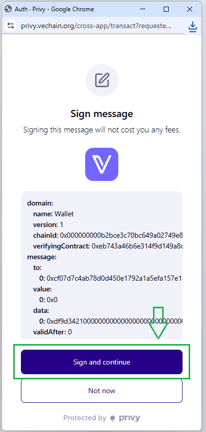

# Setting up your account

### Step 1: Go to settings tab.

<figure><figcaption></figcaption></figure>

### Step 2: Enter your name, bio, interests and others.

<figure><figcaption></figcaption></figure> <figure><figcaption></figcaption></figure>

### Step 3: Create your account.

Click on the "Create Profile" button. Then click on "Sign and Continue".

<figure><figcaption></figcaption></figure> <figure><figcaption></figcaption></figure>

