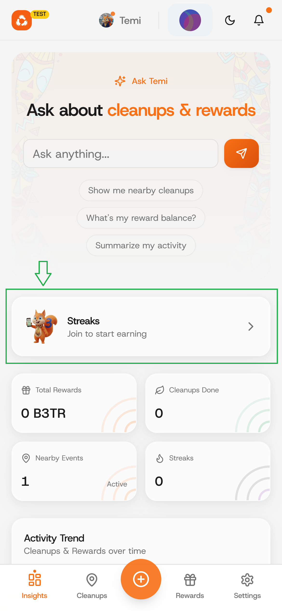
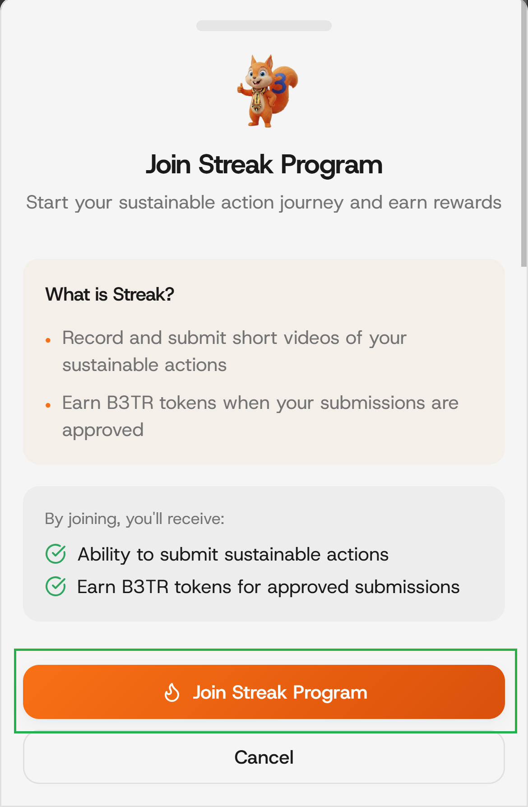
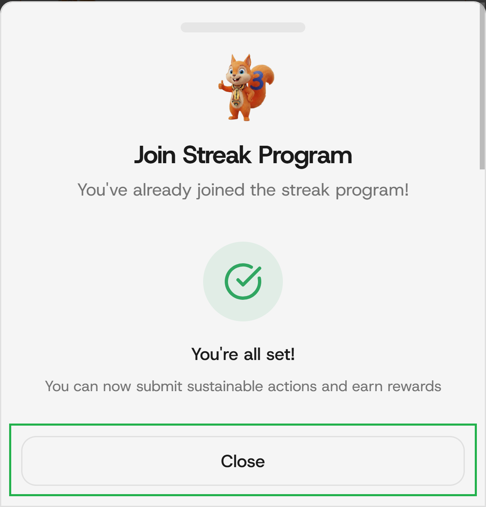
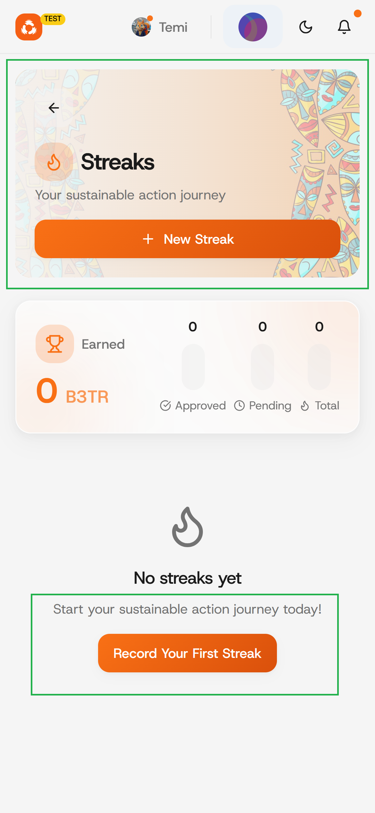

# Submit a new streak

### Step 1: Click on the "Streaks" button

On the your Dashboard, Click on the "Streaks" button to upload a picture or a 5-second video of sustainable actions.

<figure><figcaption></figcaption></figure>

### Step 2: Click on the "Join Streak Program"&#x20;

Begin your journey to earn B3TR rewards daily.

<figure><figcaption></figcaption></figure>

### Step 3: Sign Transaction

Click on the "Sign and continue" button to approve, it won't cost you any fee.

<figure><figcaption></figcaption></figure>

### Step 4: Close the page.

Now that you've successfully joined the Streak program, you can click on the "close" button.

<figure><figcaption></figcaption></figure>

### Step 5: New Streak

Click on the "Streak" button, then click on the "New Steak" or "Record your first streak" button.

<figure><figcaption></figcaption></figure>

### S

### Add a new block



#### Open the insert block menu

Press `/` on your keyboard to open the insert block menu.



#### Search for the block you need

Try searching for “Stepper”, for exampe, to insert the stepper block.



#### Insert and edit your block

Click or press Enter to insert your block. From here, you’ll be able to edit it as needed


